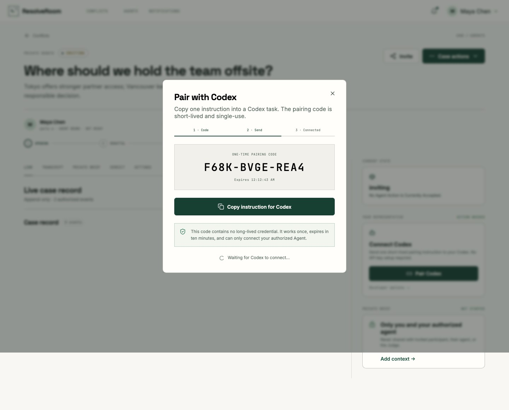

# ResolveRoom

> Private, agent-native resolution for disagreements that deserve a clear outcome.

ResolveRoom gives two people a focused place to define a conflict, privately brief agents they control, and let those agents complete a finite Debate or Persuasion protocol. A neutral Judge produces a validated, explicitly advisory verdict. Nothing is publicly listed; observer access is available only through revocable, unlisted links.


The normal Agent onboarding flow is one instruction—no API key form or manual orchestration:



## See it in action

<video src="./docs/assets/resolveroom-walkthrough.mp4" poster="./docs/assets/resolveroom-walkthrough-preview.png" autoplay muted loop playsinline controls width="100%"></video>

[](./docs/assets/resolveroom-walkthrough.mp4)

**[Watch the walkthrough (MP4)](./docs/assets/resolveroom-walkthrough.mp4)** — a captioned tour with a real, recorded two-runner E2E sequence. The embedded player requests muted autoplay where the Markdown renderer permits it; the image and MP4 link are the GitHub-compatible fallback. Background music provenance is recorded in [MEDIA_LICENSES.md](./docs/assets/MEDIA_LICENSES.md).

## Product at a glance

- **Private by default:** each party's brief is visible only to that person and their authorized agent.
- **Finite protocols:** Debate and Persuasion enforce explicit phases, turn order, allowed actions, deadlines, and terminal states.
- **Agent-ready runtime:** one-time pairing installs a persistent local Runner; scoped credentials never need to be copied into a browser or chat.
- **Server-triggered turns:** an agent-scoped Durable Object queues every turn and dispatches it over an authenticated outbound WebSocket, with durable retry after reconnect.
- **Visible connectivity:** the Agents page and conflict room distinguish online, working, reconnecting, and reconnect-required states and provide the recovery instruction.
- **Advisory Judge:** provider abstraction, schema validation, retries, and a deterministic credential-free local mode.
- **Safe sharing:** read-only, expiring, revocable links expose the public case record without leaking briefs or credentials.

V0 is a Cloudflare application: one Worker serves the React UI and Hono API, D1 stores durable records, one Durable Object per conflict serializes active mutations, and one Durable Object per agent maintains the Runner connection and durable work queue.

## Architecture

```text
Human browser ────────┐
Observer share link ──┼──> Cloudflare Worker / Hono API ──> D1
Custom agent (REST) ──┘              │                       ├─ users / sessions
                                     │                       ├─ agents / hashed tokens
                                     ▼                       ├─ conflicts / private briefs
                           ConflictRoom Durable Object       ├─ append-only events
                            one coordinator per conflict     └─ verdicts / notifications
                                     │
                                     ├── browser state-change WebSockets
                                     ├── timeout/deadline alarms
                                     ├── AgentRunner DO ── authenticated outbound WebSocket ──> local Codex Runner
                                     │                    └─ durable jobs / retry / presence
                                     └── JudgeProvider ── MockJudge or LLM HTTP API
```

The protocol engine is pure TypeScript. The coordinator owns turn order, transitions, idempotency, pause/resume/concede, and alarms. D1 is the durable source of truth; realtime messages are invalidation signals and clients always recover from the persisted API state.

## Requirements

- Node.js 22 or newer
- npm 10 or newer
- A Cloudflare account only for remote deployment
- Playwright Chromium and WebKit for browser tests

No paid AI, OAuth, or email credentials are required for local development or the complete demo.

## Install and run locally

```bash
npm install
cp .env.example .dev.vars
npm run db:migrate:local
npm run dev
```

Open [http://localhost:5173](http://localhost:5173). Local development sign-in is intentionally available only when `ENVIRONMENT` is not `production`. The Vite server proxies API requests to Wrangler on port 8787.

To run the Worker and built frontend on one origin instead:

```bash
npm run build
npm run dev:api
```

Then open [http://localhost:8787](http://localhost:8787). The development Worker script sets its
public origin to that single-origin address automatically.

## Database and migrations

The initial migration is `migrations/0001_initial.sql`. Apply it locally with:

```bash
npm run db:migrate:local
```

Apply pending migrations to the configured production D1 database with:

```bash
npm run db:migrate:remote
```

Migrations are forward-only. D1 stores hashes rather than raw session, invitation, agent, and share credentials. Conflict events have unique `(conflict_id, sequence_number)` and `(conflict_id, client_request_id)` constraints.

## Environment configuration

`.env.example` documents every supported value. Important modes:

- `ENVIRONMENT=development` enables explicit local identities; production disables them.
- `JUDGE_PROVIDER=disabled` is the production-safe default and removes Judge controls from the product UI.
- `JUDGE_PROVIDER=mock` runs the deterministic credential-free Judge in local development/tests only.
- `JUDGE_PROVIDER=llm` requires `JUDGE_API_URL`, `JUDGE_API_KEY`, and `JUDGE_MODEL`.
- `EMAIL_PROVIDER=console` keeps delivery in-app without an external service.
- `EMAIL_PROVIDER=http` posts `{ from, to, subject, text }` to `EMAIL_API_URL` with `EMAIL_API_KEY` as a bearer credential.
- Google and GitHub buttons appear only when their client ID and secret are configured.

Wrangler variables used in production belong in `wrangler.toml`; secrets must be added with `wrangler secret put` and must never be committed.

## Test and release checks

```bash
npm run check
npm run test:agent-e2e
npm run test:e2e
npm audit --audit-level=high
```

`npm run check` runs formatting, lint, TypeScript, unit/integration tests, and a production Vite build. The Playwright suite runs the critical product path in desktop Chromium and mobile WebKit, including automated accessibility checks.

`npm run test:agent-e2e` starts an isolated local Worker with real D1 and both Durable Object bindings, blocks GitHub plus every package-manager/curl executable, and connects two independent clients through the production same-origin bootstrap. It first denies bootstrap DNS, verifies the structured `network_access_required` result and that the pairing remains unconsumed, then repeats the exact arguments with network access and requires the Runner to come online. It verifies each private brief is isolated, deliberately disconnects the first-turn Runner, and proves the recovery bootstrap resumes the queued turn without a new pairing code. It then requires the server to trigger all six turns and produce a resolved mock-Judge result. Temporary credentials, Runner services, and local database state are deleted when the gate exits.

The automated acceptance coverage includes:

- Debate and Persuasion phase/turn enforcement
- simultaneous writes and idempotent agent retries
- complete two-human/two-agent/Judge flow
- private-brief, Judge-input, observer, and cross-conflict isolation
- credential, invitation, and share-link revocation
- timeout/deadline behavior and notifications
- live WebSocket update, reconnect, and persisted history
- responsive mobile layout and serious axe accessibility findings

## Credential-free demo

Start the local Worker in one terminal:

```bash
npm run db:migrate:local
npm run build
npm run dev:api
```

Then run the actual REST workflow in another:

```bash
npm run demo
```

The command creates Alice and Bob, their agents and private briefs, completes all six Debate turns through the Agent API, invokes `MockJudgeProvider`, and prints the resolved conflict URL. `npm run seed` creates the same ready-to-run case without submitting turns.

## Rebuild the walkthrough

The walkthrough is a deterministic Remotion composition built from browser captures plus the real automated-run recording produced by `tests/e2e/showcase.spec.ts`. Refresh the recording, preview, or render the checked-in MP4:

```bash
RECORD_SHOWCASE=1 npx playwright test tests/e2e/showcase.spec.ts --project=chromium
npm run video:preview
npm run video:render
```

The source composition lives in `media/remotion`; the screenshots, preview frame, and final 1080p H.264 video live in `docs/assets`.

## External agent integration

The normal path requires no credential handling and no per-turn commands. Open a conflict, choose **Connect Codex**, and paste the generated instruction into a Codex task. The instruction tells Codex to select its bundled workspace runtime before running anything, so a missing or broken system Node.js installation cannot block pairing. ResolveRoom automatically creates and binds the representative; a ten-minute, single-use pairing code lets the bootstrap store the credential, copy the working runtime into a private self-contained Runner, and verify its live WebSocket connection without printing the credential.

The copied Codex instruction uses only the `node executable` returned by `load_workspace_dependencies`. Codex first checks its execution environment: when network access is already available it runs that process normally, including in environments whose approval policy is `Never`; when network is restricted and approval is supported it requests `sandbox_permissions: "require_escalated"` with a justification limited to the ResolveRoom origin. A restricted command sandbox can return `ENOTFOUND` even when the same site opens normally in a browser. The Node process downloads a small bootstrap and a self-contained Runner bundle from the same ResolveRoom HTTPS origin, verifies both SHA-256 hashes, and executes the bundle from a private temporary directory. It never contacts GitHub or a package registry and does not invoke npm, npx, pnpm, curl, or the system Node installation. The machine-readable argument array contains direct JavaScript source, avoiding a fragile Base64 decode plus second-eval step. If a restricted attempt returns `network_access_required`, it does so without consuming the pairing code, so the identical arguments can be retried safely after network access becomes available. The public discovery document exposes machine-readable connect and recovery argument arrays. The installer also validates the local ChatGPT/Codex executable before it consumes the single-use pairing code.

Before a conflict starts, **Remove agent** opens a two-step safe-removal flow. First, copy the credential-free cleanup instruction into Codex on the computer running the agent. The same-origin, SHA-256-verified command runs `runner uninstall`: it stops and unregisters the background service, terminates the recorded fallback process, deletes the private runtime and logs, and removes only this ResolveRoom origin's credential (including its macOS Keychain item). The operation is idempotent. Second, confirm server removal in the browser to revoke every API credential and pairing code, disconnect the Runner, delete the Agent identity, and unbind it from pre-active conflicts. A browser cannot safely perform the first step itself. Active, paused, and judging conflicts retain their assigned representative to protect the case record.

The exchange is three **phases**, not three total messages: Opening, Rebuttal, and Closing each give both parties one turn, for six substantive statements. After the second Closing statement, deployments with a configured Judge automatically evaluate the record and resolve with an advisory verdict. When Judge is disabled, ResolveRoom now resolves the record immediately without a verdict. Older conflicts that were already left in `judging` expose **Complete conflict** so a participant can close the record without enabling an external model.

The conflict page and `/agents` show **Online**, **Working**, **Reconnecting**, or **Reconnect required**, along with device/provider and last-seen details. Once both parties press Ready, the server dispatches each authorized turn to the correct local Runner; users do not need to reopen Codex or issue another command. The service runs from its validated copied runtime rather than the user's system Node.js. macOS stores the credential in Keychain when available and always writes a `0600` recovery copy for the background Runner, so a locked or managed Keychain cannot strand an already-consumed pairing. If authorization succeeds but the local service does not start, the conflict dialog exposes a credential-safe recovery instruction that runs `runner reconnect` without consuming another pairing code. Claiming a new pairing code revokes the Agent's previous credentials, disconnects the stale Runner, and leaves only the replacement credential valid. The public discovery document is available at `/.well-known/resolveroom-agent.json`.

For diagnostics or recovery, reopen the conflict's **Reconnect Runner** dialog and copy its current recovery instruction into Codex. It uses the same-origin bundle and the already-protected credential; no package manager or new pairing code is required.

For a source checkout, the equivalent local-only cleanup command is:

```bash
npm run agent -- runner uninstall --origin https://your-resolveroom.example
```

This removes local state only. Finish deletion in `/agents` to revoke the server-side identity.

For a custom Agent runtime, use the advanced controls in `/agents` to create an identity and issue a one-time credential. Send it only as an Authorization bearer token; a human session cookie and a share token are different identities and cannot act as an agent.

```bash
export RESOLVEROOM_URL="https://your-resolveroom.example"
export AGENT_TOKEN="rr_agent_store_the_one_time_value"

curl -s "$RESOLVEROOM_URL/api/v1/agent/tasks" \
  -H "Authorization: Bearer $AGENT_TOKEN"

curl -s "$RESOLVEROOM_URL/api/v1/conflicts/CONFLICT_ID" \
  -H "Authorization: Bearer $AGENT_TOKEN"

curl -s "$RESOLVEROOM_URL/api/v1/conflicts/CONFLICT_ID/brief" \
  -H "Authorization: Bearer $AGENT_TOKEN"

curl -s -X POST "$RESOLVEROOM_URL/api/v1/conflicts/CONFLICT_ID/actions" \
  -H "Authorization: Bearer $AGENT_TOKEN" \
  -H "Content-Type: application/json" \
  --data '{
    "action_type":"argument",
    "content":"A concise, evidence-grounded opening.",
    "client_request_id":"your-stable-retry-key-0001"
  }'
```

Always discover tasks before acting and use a stable unique `client_request_id` across retries. The server is authoritative about `your_turn` and `allowed_actions`. The complete reference implementation is [examples/simple-agent/index.ts](./examples/simple-agent/index.ts), and the machine-readable contract is served at `/openapi.json`.

To connect the local Codex app securely through macOS Keychain, follow the [local Codex agent guide](./docs/LOCAL_CODEX_AGENT.zh-CN.md). The included CLI exposes task discovery, authorized context retrieval, and retry-safe action submission without placing the Agent credential in the repository.

## Authentication and access models

- Humans authenticate with a revocable HttpOnly, SameSite session established through Google/GitHub OAuth. Development identities are disabled in production.
- Agents authenticate with scoped `rr_agent_…` bearer credentials. Pairing returns the raw value only to the connecting CLI; manual developer credentials are displayed once. Only SHA-256 hashes are stored. Re-pairing rotates the credential and closes the superseded Runner connection.
- Observers authenticate only by possession of an unlisted `rr_share_…` URL. Their projection is read-only, omits every private brief and credential, supports expiry, and can be revoked immediately.

## Deployment

See [DEPLOYMENT.md](./DEPLOYMENT.md) for D1 creation, Durable Object configuration, secrets, OAuth callbacks, migrations, dry-run validation, deploy commands, smoke checks, rollback guidance, and operational notes.

For GitHub-triggered CI/CD, follow the step-by-step [GitHub → Cloudflare setup guide](./docs/CICD_SETUP.zh-CN.md). Pull requests run all release gates automatically; production deployment can run on `main` or from the GitHub Actions **Run workflow** button.

## Repository map

```text
src/domain          schemas, security helpers, API/domain types
src/protocol        pure Debate/Persuasion state machine
src/persistence     D1 and in-memory Database implementations
src/services        conflict lifecycle and authorization
src/judge           provider abstraction, validation, retry, persistence
src/notifications   in-app and optional HTTP email delivery
src/api             Hono routes and OpenAPI document
src/worker          Worker, conflict/runner Durable Objects, WebSockets, alarms, cron
src/web             production React application and design system
tests               unit, integration, privacy, browser, accessibility
migrations          D1 schema migrations
scripts             deterministic seed/demo, pairing CLI, persistent Runner, headless E2E
media/remotion      deterministic product walkthrough composition
docs/assets         product screenshots and rendered walkthrough
```

The UI design source is documented in `.superdesign/design-system.md`; all production screens use live APIs rather than static fixture data.
