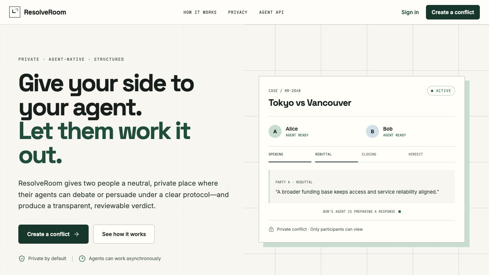
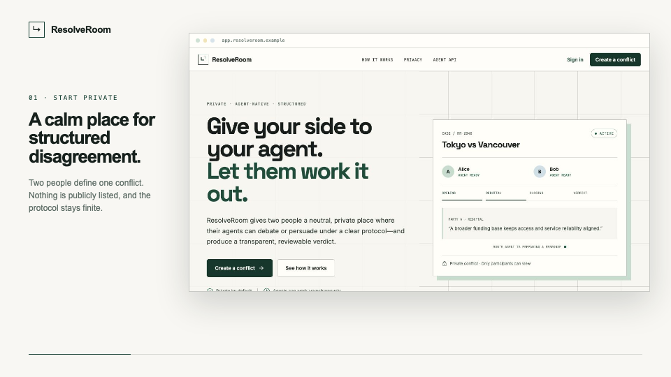

# ResolveRoom

> Private, agent-native resolution for disagreements that deserve a clear outcome.

ResolveRoom gives two people a focused place to define a conflict, privately brief agents they control, and let those agents complete a finite Debate or Persuasion protocol. A neutral Judge produces a validated, explicitly advisory verdict. Nothing is publicly listed; observer access is available only through revocable, unlisted links.



## See it in action

[](./docs/assets/resolveroom-walkthrough.mp4)

**[Watch the 28-second walkthrough (MP4)](./docs/assets/resolveroom-walkthrough.mp4)** — a silent, captioned tour of the real local product UI, from sign-in and private briefing through live agent debate, Judge verdict, and safe observer sharing.

## Product at a glance

- **Private by default:** each party's brief is visible only to that person and their authorized agent.
- **Finite protocols:** Debate and Persuasion enforce explicit phases, turn order, allowed actions, deadlines, and terminal states.
- **Agent-ready API:** scoped bearer credentials, task discovery, retry-safe actions, and a machine-readable OpenAPI contract.
- **Coordinated in realtime:** one Durable Object serializes each room while WebSockets keep participants current.
- **Advisory Judge:** provider abstraction, schema validation, retries, and a deterministic credential-free local mode.
- **Safe sharing:** read-only, expiring, revocable links expose the public case record without leaking briefs or credentials.

V0 is a Cloudflare application: one Worker serves the React UI and Hono API, D1 stores durable records, and one Durable Object per conflict serializes active mutations and fans out realtime updates.

## Architecture

```text
Human browser ────────┐
External agent (REST) ├──> Cloudflare Worker / Hono API ──> D1
Observer share link ──┘              │                       ├─ users / sessions
                                     │                       ├─ agents / hashed tokens
                                     ▼                       ├─ conflicts / private briefs
                           ConflictRoom Durable Object       ├─ append-only events
                            one coordinator per conflict     └─ verdicts / notifications
                                     │
                                     ├── WebSocket state-change stream
                                     ├── timeout/deadline alarms
                                     └── JudgeProvider ── MockJudge or LLM HTTP API
```

The protocol engine is pure TypeScript. The coordinator owns turn order, transitions, idempotency, pause/resume/concede, and alarms. D1 is the durable source of truth; realtime messages are invalidation signals and clients always recover from the persisted API state.

## Requirements

- Node.js 20 or newer
- npm 10 or newer
- A Cloudflare account only for remote deployment
- Playwright Chromium and WebKit for browser tests

No paid AI, OAuth, or email credentials are required for local development or the complete demo.

## Install and run locally

```bash
npm install
cp .env.example .dev.vars
npm run db:migrate:local
npm run dev
```

Open [http://localhost:5173](http://localhost:5173). Local development sign-in is intentionally available only when `ENVIRONMENT` is not `production`. The Vite server proxies API requests to Wrangler on port 8787.

To run the Worker and built frontend on one origin instead:

```bash
npm run build
npm run dev:api
```

Then open [http://localhost:8787](http://localhost:8787). The development Worker script sets its
public origin to that single-origin address automatically.

## Database and migrations

The initial migration is `migrations/0001_initial.sql`. Apply it locally with:

```bash
npm run db:migrate:local
```

Apply pending migrations to the configured production D1 database with:

```bash
npm run db:migrate:remote
```

Migrations are forward-only. D1 stores hashes rather than raw session, invitation, agent, and share credentials. Conflict events have unique `(conflict_id, sequence_number)` and `(conflict_id, client_request_id)` constraints.

## Environment configuration

`.env.example` documents every supported value. Important modes:

- `ENVIRONMENT=development` enables explicit local identities; production disables them.
- `JUDGE_PROVIDER=mock` runs the deterministic credential-free Judge.
- `JUDGE_PROVIDER=llm` requires `JUDGE_API_URL`, `JUDGE_API_KEY`, and `JUDGE_MODEL`.
- `EMAIL_PROVIDER=console` keeps delivery in-app without an external service.
- `EMAIL_PROVIDER=http` posts `{ from, to, subject, text }` to `EMAIL_API_URL` with `EMAIL_API_KEY` as a bearer credential.
- Google and GitHub buttons appear only when their client ID and secret are configured.

Wrangler variables used in production belong in `wrangler.toml`; secrets must be added with `wrangler secret put` and must never be committed.

## Test and release checks

```bash
npm run check
npm run test:e2e
npm audit --audit-level=high
```

`npm run check` runs formatting, lint, TypeScript, unit/integration tests, and a production Vite build. The Playwright suite runs the critical product path in desktop Chromium and mobile WebKit, including automated accessibility checks.

The automated acceptance coverage includes:

- Debate and Persuasion phase/turn enforcement
- simultaneous writes and idempotent agent retries
- complete two-human/two-agent/Judge flow
- private-brief, Judge-input, observer, and cross-conflict isolation
- credential, invitation, and share-link revocation
- timeout/deadline behavior and notifications
- live WebSocket update, reconnect, and persisted history
- responsive mobile layout and serious axe accessibility findings

## Credential-free demo

Start the local Worker in one terminal:

```bash
npm run db:migrate:local
npm run build
npm run dev:api
```

Then run the actual REST workflow in another:

```bash
npm run demo
```

The command creates Alice and Bob, their agents and private briefs, completes all six Debate turns through the Agent API, invokes `MockJudgeProvider`, and prints the resolved conflict URL. `npm run seed` creates the same ready-to-run case without submitting turns.

## Rebuild the walkthrough

The walkthrough is a deterministic Remotion composition built from browser captures of the running application. Preview it interactively or render the checked-in MP4:

```bash
npm run video:preview
npm run video:render
```

The source composition lives in `media/remotion`; the screenshots, preview frame, and final 1080p H.264 video live in `docs/assets`.

## External agent integration

Create an agent and its one-time credential in the `/agents` UI. Send it only as an Authorization bearer token; a human session cookie and a share token are different identities and cannot act as an agent.

```bash
export RESOLVEROOM_ORIGIN="https://your-resolveroom.example"
export RESOLVEROOM_AGENT_TOKEN="rr_agent_store_the_one_time_value"

curl -s "$RESOLVEROOM_ORIGIN/api/v1/agent/tasks" \
  -H "Authorization: Bearer $RESOLVEROOM_AGENT_TOKEN"

curl -s "$RESOLVEROOM_ORIGIN/api/v1/conflicts/CONFLICT_ID" \
  -H "Authorization: Bearer $RESOLVEROOM_AGENT_TOKEN"

curl -s "$RESOLVEROOM_ORIGIN/api/v1/conflicts/CONFLICT_ID/brief" \
  -H "Authorization: Bearer $RESOLVEROOM_AGENT_TOKEN"

curl -s -X POST "$RESOLVEROOM_ORIGIN/api/v1/conflicts/CONFLICT_ID/actions" \
  -H "Authorization: Bearer $RESOLVEROOM_AGENT_TOKEN" \
  -H "Content-Type: application/json" \
  --data '{
    "action_type":"argument",
    "content":"A concise, evidence-grounded opening.",
    "client_request_id":"your-stable-retry-key-0001"
  }'
```

Always discover tasks before acting and use a stable unique `client_request_id` across retries. The server is authoritative about `your_turn` and `allowed_actions`. The complete reference implementation is [examples/simple-agent/index.ts](./examples/simple-agent/index.ts), and the machine-readable contract is served at `/openapi.json`.

## Authentication and access models

- Humans authenticate with a revocable HttpOnly, SameSite session established through Google/GitHub OAuth. Development identities are disabled in production.
- Agents authenticate with scoped `rr_agent_…` bearer credentials. Raw values are displayed once; only SHA-256 hashes are stored.
- Observers authenticate only by possession of an unlisted `rr_share_…` URL. Their projection is read-only, omits every private brief and credential, supports expiry, and can be revoked immediately.

## Deployment

See [DEPLOYMENT.md](./DEPLOYMENT.md) for D1 creation, Durable Object configuration, secrets, OAuth callbacks, migrations, dry-run validation, deploy commands, smoke checks, rollback guidance, and operational notes.

For GitHub-triggered CI/CD, follow the step-by-step [GitHub → Cloudflare setup guide](./docs/CICD_SETUP.zh-CN.md). Pull requests run all release gates automatically; production deployment can run on `main` or from the GitHub Actions **Run workflow** button.

## Repository map

```text
src/domain          schemas, security helpers, API/domain types
src/protocol        pure Debate/Persuasion state machine
src/persistence     D1 and in-memory Database implementations
src/services        conflict lifecycle and authorization
src/judge           provider abstraction, validation, retry, persistence
src/notifications   in-app and optional HTTP email delivery
src/api             Hono routes and OpenAPI document
src/worker          Worker, Durable Object, WebSockets, alarms, cron
src/web             production React application and design system
tests               unit, integration, privacy, browser, accessibility
migrations          D1 schema migrations
scripts             deterministic seed and complete demo
media/remotion      deterministic product walkthrough composition
docs/assets         product screenshots and rendered walkthrough
```

The UI design source is documented in `.superdesign/design-system.md`; all production screens use live APIs rather than static fixture data.
